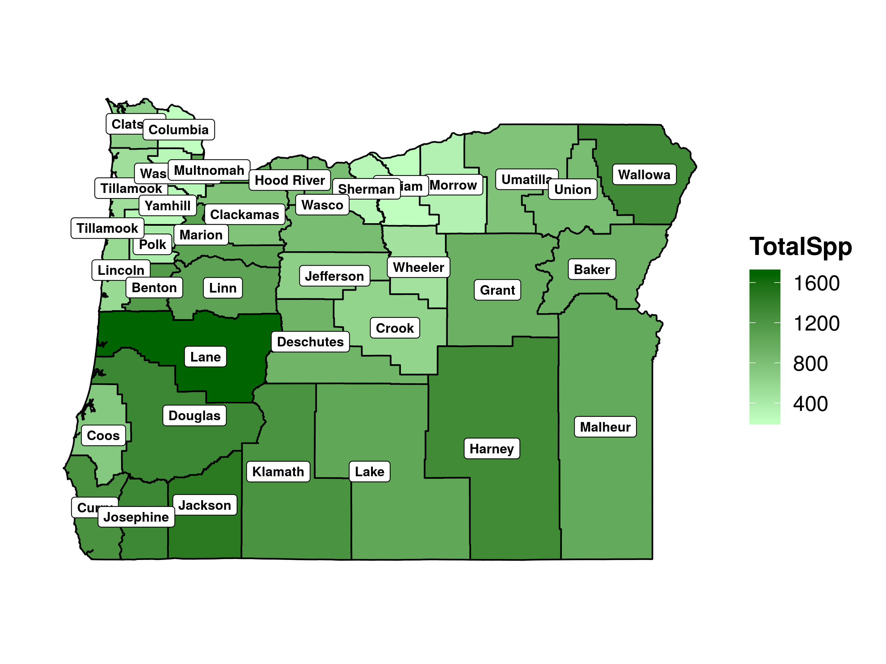
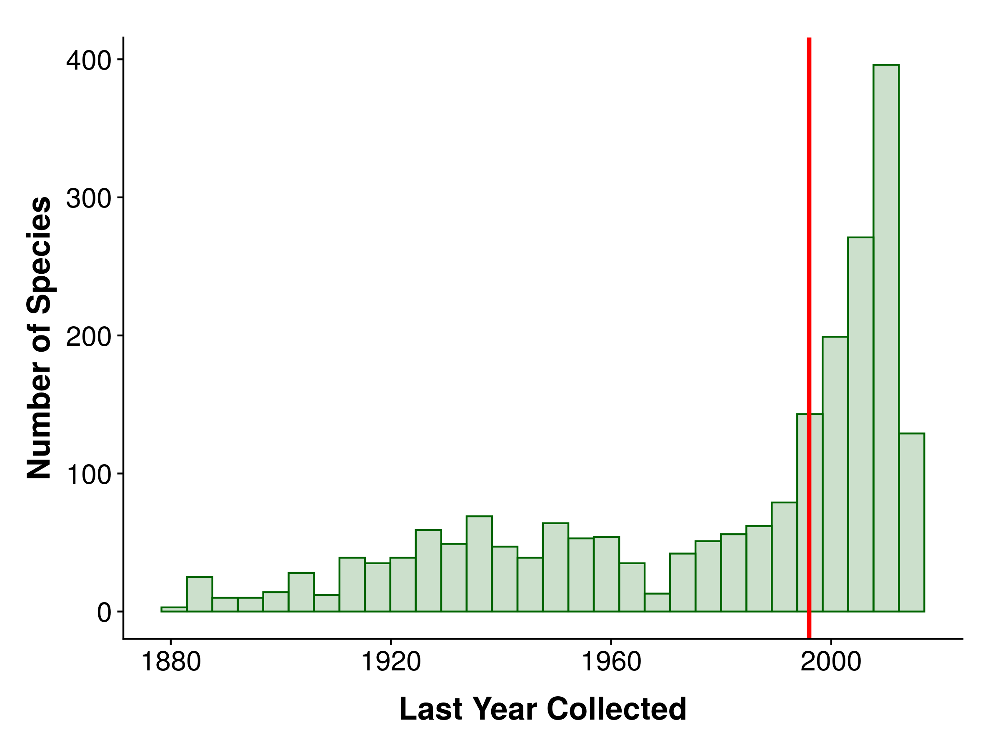

OSC Herbarium
================
James Mickley
February 02, 2020

-   [Overview](#overview)
    -   [Summary of Results](#summary-of-results)
-   [Summaries](#summaries)
    -   [Species](#species)
    -   [Locations](#locations)
    -   [Collectors](#collectors)
-   [Sampling Biases](#sampling-biases)
    -   [Spatial](#spatial)
    -   [Temporal](#temporal)
    -   [Spatiotemporal](#spatiotemporal)
    -   [Undersampled Species](#undersampled-species)
    -   [Common Species Temporal Sampling](#common-species-temporal-sampling)
    -   [Invasive Species Temporal Sampling](#invasive-species-temporal-sampling)
-   [iNaturalist](#inaturalist)
-   [Session Information](#session-information)

## Overview

This is my exploratory analysis of the OSU herbarium’s vascular plants.

Primarily, I’m concerned with understanding sampling in space, time, and
across species. But, it’s also an opportunity to explore the collection,
looking at major collectors and plant families, and assessing which
species are best represented.

### Summary of Results

  - There’s a lot of spatial variation in collecting intensity. Lane,
    Benton, Harney, and Wallowa Counties stand out as the best-sampled
    areas.
  - The 1910-1950 era was when the bulk of the specimens were collected.
    Collecting in the 2010s was particularly low.
  - Collection through time was similar in most counties, though a few
    have not had much activity since the 1950s.
  - Of ~4500 total species in the dataset, half are represented by 12 or
    fewer specimens. Nearly 1000 species are only represented by 1-2
    specimens.
  - 750 species have not been collected in 50 years.
  - Even for the best-represented species in the herbarium, sampling has
    been low since 1950.
  - Common trees do not have much sampling at any point in time.
  - Common invasive species have been mostly ignored by collectors, with
    minimal sampling.
  - By comparison, iNaturalist added 60,000 records in Oregon just in
    2019\!

## Summaries

### Species

The OSC herbarium has just over 4500 species of vascular plant in Oregon
with good data (IDed to species, good location and date).

Here’s a summary of the number of families, species, and specimens
represented, along with stats for the most common families.

| Families | Species | Specimens |
| -------: | ------: | --------: |
|      162 |    4539 |    111678 |

| Family          | Species | Specimens |
| :-------------- | ------: | --------: |
| Asteraceae      |     561 |     14531 |
| Poaceae         |     390 |      8879 |
| Fabaceae        |     241 |      7280 |
| Rosaceae        |     186 |      4960 |
| Cyperaceae      |     221 |      4611 |
| Brassicaceae    |     230 |      3926 |
| Plantaginaceae  |     130 |      3844 |
| Ranunculaceae   |      96 |      3499 |
| Apiaceae        |     132 |      3421 |
| Polygonaceae    |     124 |      3294 |
| Onagraceae      |      86 |      2648 |
| Ericaceae       |      69 |      2520 |
| Orobanchaceae   |      86 |      2460 |
| Boraginaceae    |     110 |      2423 |
| Polemoniaceae   |      88 |      2376 |
| Caryophyllaceae |     118 |      2365 |
| Saxifragaceae   |      75 |      2118 |
| Liliaceae       |      63 |      1674 |
| Hydrophyllaceae |      49 |      1668 |
| Juncaceae       |      71 |      1609 |

### Locations

A map of all the specimen records to look at sampling intensity across
space.

It looks like there’s less sampling in the mountains, unsurprisingly.

<!-- -->

### Collectors

A list of important collectors for Oregon specimens in OSC, with active
dates.

Morton Peck of WILLU tops the list (Manual of the Higher Plants of OR).
Louis Henderson of UofO is second, and Richard Halse is third.

Some great information on the background of these collectors is
[here](https://bpp.oregonstate.edu/herbarium/databases/collectors-specimen-database).

| Collector         | Specimens | NumSpecies | FirstAccession | LastAccession |
| :---------------- | --------: | ---------: | -------------: | ------------: |
| M.E. Peck         |     19409 |       2867 |           1900 |          1958 |
| L.F. Henderson    |      6870 |       1941 |           1878 |          1987 |
| Richard R. Halse  |      4496 |       1770 |           1973 |          2016 |
| Georgia Mason     |      3138 |       1090 |           1956 |          1980 |
| Lilla Leach       |      2919 |       1261 |           1908 |          1955 |
| W.E. Lawrence     |      2492 |        913 |           1911 |          1947 |
| L.E. Detling      |      2257 |        941 |           1928 |          1962 |
| Orlin L. Ireland  |      1840 |        975 |           1927 |          1970 |
| K.L. Chambers     |      1814 |        894 |           1946 |          2009 |
| William H. Baker  |      1677 |        831 |           1927 |          1982 |
| Thomas Howell     |      1418 |        913 |           1877 |          1899 |
| W.C. Cusick       |      1265 |        687 |           1880 |          1918 |
| Albert N. Steward |      1218 |        734 |           1920 |          1959 |
| E.P. Sheldon      |      1167 |        632 |           1882 |          1908 |
| LeRoy E. Detling  |      1094 |        600 |           1923 |          1964 |
| Helen M. Gilkey   |       944 |        607 |           1904 |          1960 |
| John B. Leiberg   |       900 |        651 |           1886 |          1910 |
| H.C. Gilbert      |       882 |        386 |           1912 |          1961 |
| S.C. Head         |       852 |        422 |           1950 |          1959 |
| Charles G. Hansen |       839 |        474 |           1950 |          1957 |

## Sampling Biases

Let’s look at biases or weaknesses in sampling in three axes: spatial,
temporal, and across species.

### Spatial

Counties vary a lot in the number of specimens, from over 9000 to less
than 500. This is pretty typical for an herbarium.

Lane and Benton Counties are well represented, so are Harney, Wallowa,
and Josephine.

This makes clear that some counties are badly in need of more sampling.
Alternatively, one could focus on those well-sampled counties and
maintain those
datasets.

<!-- --><!-- -->

Species diversity at the county level looks partly tied to the number of
specimens. Counties with more specimens have more diversity.

This suggests that sampling is incomplete at the county level; we’d like
to see diversity be more independent of sampling.

<!-- -->

### Temporal

This shows a fine-grained analysis of the number of specimens collected
each year. There’s a lot of variation, as collecting has ebbed and
flowed, but there’s been a reduction in the last five years or so.

<!-- -->

Simplifying a bit, we can look at specimens by decade. The best sampling
was in 1910-1950. The 2010s is the lowest decade since the 1890s.

<!-- -->

### Spatiotemporal

We can also get a sense of specimens by decade by county to see if there
are any spatiotemporal trends. For the most part, counties follow the
broader temporal pattern. Multnomah, Klamath, Umatilla, and Marion have
hardly been sampled in a long time, though.

<!-- -->

Here, we focus on the six most-sampled
counties

<!-- -->

### Undersampled Species

One way to get at data-deficient species, is to look at the number of
species with very few records.

Of the 4500 species recorded, over 2000 are represented by less than 10
specimens statewide (median 12 specimens per species), and nearly 1000
species are only represented by 1-2 specimens. These would be a good
target for further collecting, though it’s possible some are outdated
names or something of that sort.

Here’s a breakdown of the species with 10 or fewer specimens:

| Species | Specimens |
| ------: | --------: |
|     591 |         1 |
|     344 |         2 |
|     259 |         3 |
|     170 |         4 |
|     149 |         5 |
|     150 |         6 |
|     130 |         7 |
|     130 |         8 |
|     104 |         9 |
|      98 |        10 |

<!-- -->

Another way that we can look at sampling across species is to add a time
component and look for species that have not been collected in a long
time.

When we look at when each species was last collected, the median is year
of last collection 1996, so half of the species have not been collected
in about 25 years. There’s a significant proportion that have not been
collected in over 50 years too (since 1970).

Again, these could be old names, but they could also be species that
have become rare or extinct, or simply haven’t been looked for, because
of inaccessibility or because of lack of taxonomic
expertise.

<!-- -->

A dataset of the species that have not been collected in 50 years, with
the last year they were collected is available at
[oldcollections.csv](/data/oldcollections.csv)

The actual number of species not collected in 50 years:

| Species\_Not\_Collected\_In\_50\_Years |
| -------------------------------------: |
|                                    755 |

Here’s a map of where species that have not been collected in 50 years
were originally collected.

<!-- -->

### Common Species Temporal Sampling

This shows temporal sampling for the 16 most common species in the
herbarium.

Again, they mostly follow the broader temporal trend, with sampling
falling off post-1950.

<!-- -->

We can focus in on the three most common species. Also, I’ve included
three tree species that are relatively common in the landscape for
comparison.

Common trees really haven’t been sampled much. Even the really common
species in the herbarium haven’t added many specimens in recent decades.

<!-- -->

### Invasive Species Temporal Sampling

Likewise, we can look at temporal sampling for some common invasives.
These invasives are not well sampled at all, regardless of decade.
They’re another possible focal point of targeted collecting.

<!-- -->

## iNaturalist

By comparison to the herbarium data, iNaturalist observations are
growing exponentially.

iNaturalist has collected more observations in Oregon in each of the
last four years than the best year for the herbarium, and last year it
was 60,000\!

<!-- -->

## Session Information

``` 
R version 3.6.1 (2019-07-05)
Platform: x86_64-pc-linux-gnu (64-bit)
Running under: Ubuntu 18.04.3 LTS

Matrix products: default
BLAS:   /usr/lib/x86_64-linux-gnu/blas/libblas.so.3.7.1
LAPACK: /usr/lib/x86_64-linux-gnu/lapack/liblapack.so.3.7.1

locale:
 [1] LC_CTYPE=en_US.UTF-8       LC_NUMERIC=C              
 [3] LC_TIME=en_US.UTF-8        LC_COLLATE=en_US.UTF-8    
 [5] LC_MONETARY=en_US.UTF-8    LC_MESSAGES=en_US.UTF-8   
 [7] LC_PAPER=en_US.UTF-8       LC_NAME=C                 
 [9] LC_ADDRESS=C               LC_TELEPHONE=C            
[11] LC_MEASUREMENT=en_US.UTF-8 LC_IDENTIFICATION=C       

attached base packages:
[1] stats     graphics  grDevices utils     datasets  methods   base     

other attached packages:
 [1] sf_0.8-0        taxize_0.9.91   knitr_1.27      cowplot_1.0.0  
 [5] forcats_0.4.0   stringr_1.4.0   dplyr_0.8.3     purrr_0.3.3    
 [9] readr_1.3.1     tidyr_1.0.0     tibble_2.1.3    ggplot2_3.2.1  
[13] tidyverse_1.3.0

loaded via a namespace (and not attached):
 [1] httr_1.4.1         jsonlite_1.6       foreach_1.4.7      bold_0.9.0        
 [5] modelr_0.1.5       assertthat_0.2.1   highr_0.8          triebeard_0.3.0   
 [9] urltools_1.7.3     cellranger_1.1.0   yaml_2.2.0         pillar_1.4.2      
[13] backports_1.1.5    lattice_0.20-38    glue_1.3.1         digest_0.6.23     
[17] rvest_0.3.5        colorspace_1.4-1   htmltools_0.4.0    plyr_1.8.4        
[21] ritis_0.8.0        pkgconfig_2.0.3    httpcode_0.2.0     broom_0.5.2       
[25] haven_2.2.0        scales_1.1.0       solrium_1.1.4      farver_2.0.1      
[29] generics_0.0.2     withr_2.1.2        lazyeval_0.2.2     cli_1.1.0         
[33] magrittr_1.5       crayon_1.3.4       readxl_1.3.1       evaluate_0.14     
[37] fansi_0.4.0        fs_1.3.1           nlme_3.1-142       xml2_1.2.2        
[41] class_7.3-15       tools_3.6.1        data.table_1.12.6  hms_0.5.2         
[45] lifecycle_0.1.0    munsell_0.5.0      reprex_0.3.0       compiler_3.6.1    
[49] e1071_1.7-3        rlang_0.4.2        classInt_0.4-2     units_0.6-5       
[53] grid_3.6.1         iterators_1.0.12   rstudioapi_0.10    labeling_0.3      
[57] rmarkdown_2.1      gtable_0.3.0       codetools_0.2-16   DBI_1.0.0         
[61] reshape_0.8.8      curl_4.3           reshape2_1.4.3     R6_2.4.1          
[65] zoo_1.8-6          lubridate_1.7.4    utf8_1.1.4         zeallot_0.1.0     
[69] rprojroot_1.3-2    KernSmooth_2.23-16 ape_5.3            stringi_1.4.3     
[73] parallel_3.6.1     crul_0.9.0         Rcpp_1.0.3         vctrs_0.2.0       
[77] dbplyr_1.4.2       tidyselect_0.2.5   xfun_0.11         
```
