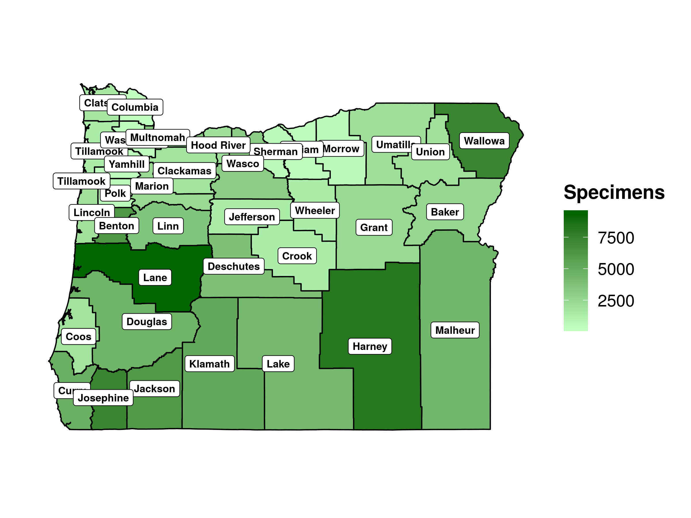

OSC Herbarium
================
James Mickley
January 26, 2020

## Overview

What is this analysis about?

### Summary of Results

  - 
## Summaries

A summary of the number of families, species, and specimens represented,
along with stats for the most common families

| Families | Species | Specimens |
| -------: | ------: | --------: |
|      162 |    4539 |    111678 |

| Family          | Species | Specimens |
| :-------------- | ------: | --------: |
| Asteraceae      |     561 |     14531 |
| Poaceae         |     390 |      8879 |
| Fabaceae        |     241 |      7280 |
| Rosaceae        |     186 |      4960 |
| Cyperaceae      |     221 |      4611 |
| Brassicaceae    |     230 |      3926 |
| Plantaginaceae  |     130 |      3844 |
| Ranunculaceae   |      96 |      3499 |
| Apiaceae        |     132 |      3421 |
| Polygonaceae    |     124 |      3294 |
| Onagraceae      |      86 |      2648 |
| Ericaceae       |      69 |      2520 |
| Orobanchaceae   |      86 |      2460 |
| Boraginaceae    |     110 |      2423 |
| Polemoniaceae   |      88 |      2376 |
| Caryophyllaceae |     118 |      2365 |
| Saxifragaceae   |      75 |      2118 |

<!-- -->

### Specimens and species by county

## Sampling Biases

### Spatial

<!-- --><!-- -->

Species diversity at the county level looks partly tied to the number of
specimens. Counties with more specimens have more diversity. This
suggests that sampling is incomplete at the county
level.

<!-- -->

### Temporal

<!-- -->

<!-- -->

### Spatiotemporal

<!-- -->

<!-- -->

### Undersampled Species

Undersampled Species One way to get at data-deficient species, is to
look at the number of species with very few records.

Of the 4500 species recorded, over 2000 less than 10 specimens
statewide, and nearly 1000 species are only represented by 1-2
specimens. These would be a good target, though it’s possible some are
outdated names or something of that sort.

Notably though, most of the undersampled species were collected
recently. There are pockets of undersampled species that haven’t been
collected recently in the CT River Valley, New London, and the NW corner
that might be worth looking into.

| Specimens | Species |
| --------: | ------: |
|         1 |     591 |
|         2 |     344 |
|         3 |     259 |
|         4 |     170 |
|         5 |     149 |
|         6 |     150 |
|         7 |     130 |
|         8 |     130 |
|         9 |     104 |
|        10 |      98 |

<!-- -->

<!-- -->

    ## # A tibble: 1 x 1
    ##       n
    ##   <int>
    ## 1   755

<!-- -->

### Common Species Temporal Sampling

<!-- -->

<!-- -->

### Invasive Species Temporal Sampling

<!-- -->

## iNaturalist

<!-- -->

### Temporal

show increase in sampling

### Spatial

show map

### Invasives

### Common Species

## Session Information

``` 
R version 3.6.1 (2019-07-05)
Platform: x86_64-pc-linux-gnu (64-bit)
Running under: Ubuntu 18.04.3 LTS

Matrix products: default
BLAS:   /usr/lib/x86_64-linux-gnu/blas/libblas.so.3.7.1
LAPACK: /usr/lib/x86_64-linux-gnu/lapack/liblapack.so.3.7.1

locale:
 [1] LC_CTYPE=en_US.UTF-8       LC_NUMERIC=C              
 [3] LC_TIME=en_US.UTF-8        LC_COLLATE=en_US.UTF-8    
 [5] LC_MONETARY=en_US.UTF-8    LC_MESSAGES=en_US.UTF-8   
 [7] LC_PAPER=en_US.UTF-8       LC_NAME=C                 
 [9] LC_ADDRESS=C               LC_TELEPHONE=C            
[11] LC_MEASUREMENT=en_US.UTF-8 LC_IDENTIFICATION=C       

attached base packages:
[1] stats     graphics  grDevices utils     datasets  methods   base     

other attached packages:
 [1] sf_0.8-0        taxize_0.9.91   knitr_1.27      cowplot_1.0.0  
 [5] forcats_0.4.0   stringr_1.4.0   dplyr_0.8.3     purrr_0.3.3    
 [9] readr_1.3.1     tidyr_1.0.0     tibble_2.1.3    ggplot2_3.2.1  
[13] tidyverse_1.3.0

loaded via a namespace (and not attached):
 [1] httr_1.4.1         jsonlite_1.6       foreach_1.4.7      bold_0.9.0        
 [5] modelr_0.1.5       assertthat_0.2.1   highr_0.8          triebeard_0.3.0   
 [9] urltools_1.7.3     cellranger_1.1.0   yaml_2.2.0         pillar_1.4.2      
[13] backports_1.1.5    lattice_0.20-38    glue_1.3.1         digest_0.6.23     
[17] rvest_0.3.5        colorspace_1.4-1   htmltools_0.4.0    plyr_1.8.4        
[21] ritis_0.8.0        pkgconfig_2.0.3    httpcode_0.2.0     broom_0.5.2       
[25] haven_2.2.0        scales_1.1.0       solrium_1.1.4      farver_2.0.1      
[29] generics_0.0.2     withr_2.1.2        lazyeval_0.2.2     cli_1.1.0         
[33] magrittr_1.5       crayon_1.3.4       readxl_1.3.1       evaluate_0.14     
[37] fansi_0.4.0        fs_1.3.1           nlme_3.1-142       xml2_1.2.2        
[41] class_7.3-15       tools_3.6.1        data.table_1.12.6  hms_0.5.2         
[45] lifecycle_0.1.0    munsell_0.5.0      reprex_0.3.0       compiler_3.6.1    
[49] e1071_1.7-3        rlang_0.4.2        classInt_0.4-2     units_0.6-5       
[53] grid_3.6.1         iterators_1.0.12   rstudioapi_0.10    labeling_0.3      
[57] rmarkdown_2.1      gtable_0.3.0       codetools_0.2-16   DBI_1.0.0         
[61] reshape_0.8.8      curl_4.3           reshape2_1.4.3     R6_2.4.1          
[65] zoo_1.8-6          lubridate_1.7.4    utf8_1.1.4         zeallot_0.1.0     
[69] rprojroot_1.3-2    KernSmooth_2.23-16 ape_5.3            stringi_1.4.3     
[73] parallel_3.6.1     crul_0.9.0         Rcpp_1.0.3         vctrs_0.2.0       
[77] dbplyr_1.4.2       tidyselect_0.2.5   xfun_0.11         
```
